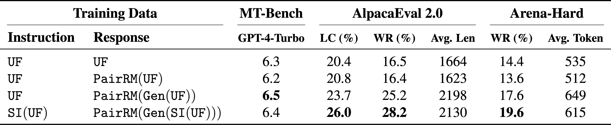
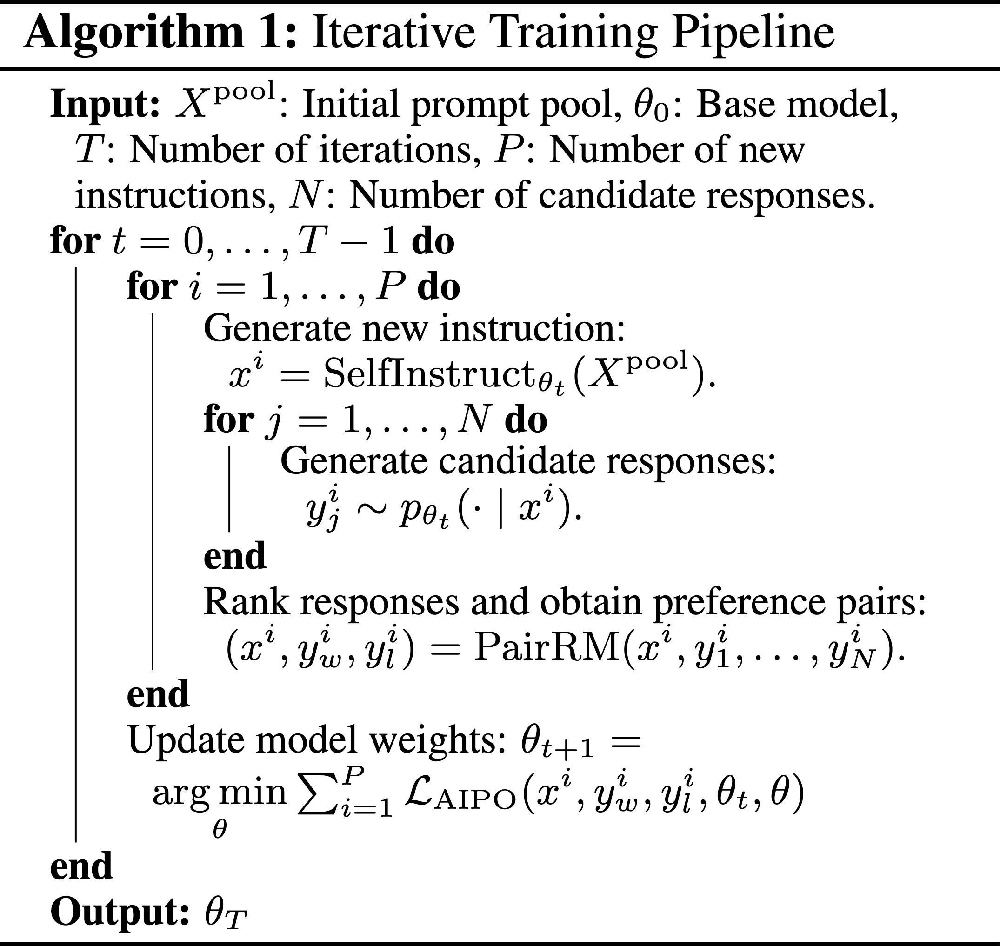
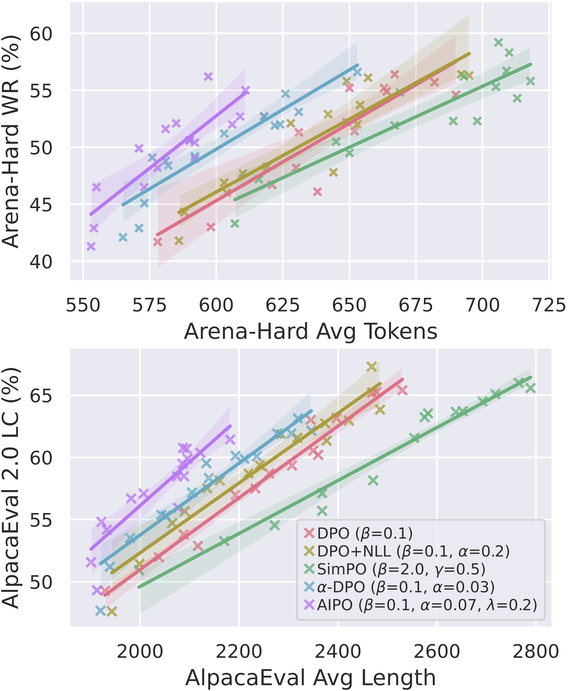

<!--more-->

<section class="hero">
  

    

      

        

          <h1 class="title is-1 publication-title">AIPO: Improving Training Objective for Iterative Preference
            Optimization</h1>
          

            
              <a href="https://acherstyx.github.io">Yaojie Shen</a>1,2,
            
              <a href="https://www.linkedin.com/in/xinyaowang/">Xinyao Wang</a>3,
            
              <a href="https://yuleiniu.github.io/">Yulei Niu</a>3,
            
            
              Ying Zhou1,2,
            
            
              Lexin Tang3,
            
            
              Libo Zhang1,2,
            
            
              <a href="https://www.linkedin.com/in/fan-chen-42732438">Fan Chen</a>3,
            
            
              <a href="https://scholar.google.com/citations?user=PO9WFl0AAAAJ&hl=en">Longyin Wen</a>3
            
          

          

            1 Institute of Software, Chinese Academy of Sciences
            2 University of Chinese Academy of Sciences 
            3 ByteDance Inc.
          

          

            

              
                <a href="https://arxiv.org/pdf/2409.08845" class="external-link button is-normal is-rounded is-dark">
                  
                    <i class="fas fa-file-pdf"></i>
                  
                  Paper
                </a>
              
              
                <a href="https://arxiv.org/abs/2409.08845" class="external-link button is-normal is-rounded is-dark">
                  
                    <i class="ai ai-arxiv"></i>
                  
                  arXiv
                </a>
              
              
                <a href="https://github.com/bytedance/AIPO" class="external-link button is-normal is-rounded is-dark">
                  
                    <i class="fab fa-github"></i>
                  
                  Code (coming soon)
                </a>
              
            

          

        

      

    

  

</section>

<section class="hero teaser">
  

    

      

        

          <table style="font-size: 0.9em;">
            <tr>
              <td><b>Model</b></td>
              <td><b>Arena-Hard WR &uarr;</b></td>
              <td><b>Arena-Hard Avg. Token</b></td>
              <td><b>AlpacaEval 2.0 LC</b></td>
              <td><b>AlpacaEval Avg. Length</b></td>
            </tr>
            <tr class="ours">
              <td>AIPO (Mistral-Large 2407)</td>
              <td>81.6</td>
              <td>656</td>
              <td>67.8</td>
              <td>2277</td>
            </tr>
            <tr>
              <td>Claude 3.5 Sonnet (06/20)</td>
              <td>79.3</td>
              <td>567</td>
              <td>52.4</td>
              <td>1488</td>
            </tr>
            <tr>
              <td>GPT-4 Omni (05/13)</td>
              <td>79.2</td>
              <td>696</td>
              <td>57.5</td>
              <td>1873</td>
            </tr>
            <tr>
              <td>GPT-4o Mini</td>
              <td>74.9</td>
              <td>668</td>
              <td>50.7</td>
              <td>1861</td>
            </tr>
            <tr class="ours">
              <td>AIPO (Llama-3-70B-Instruct)</td>
              <td>63.5</td>
              <td>616</td>
              <td>60.5</td>
              <td>2081</td>
            </tr>
            <tr class="ours">
              <td>AIPO (Gemma-2-27B-It)</td>
              <td>63.5</td>
              <td>643</td>
              <td>57.8</td>
              <td>1768</td>
            </tr>
            <tr>
              <td>Claude 3 Opus (02/29)</td>
              <td>60.4</td>
              <td>541</td>
              <td>40.5</td>
              <td>1388</td>
            </tr>
            <tr class="ours">
              <td>AIPO (Mistral-Nemo-Instruct-2407)</td>
              <td>56.2</td>
              <td>597</td>
              <td>60.4</td>
              <td>2122</td>
            </tr>
            <tr>
              <td>Claude 3 Sonnet (02/29)</td>
              <td>46.8</td>
              <td>552</td>
              <td>34.9</td>
              <td>1420</td>
            </tr>
            <tr>
              <td>GPT-4 (06/13)</td>
              <td>37.9</td>
              <td>354</td>
              <td>30.2</td>
              <td>1140</td>
            </tr>
            <tr>
              <td>GPT-3.5 Turbo (06/13)</td>
              <td>24.8</td>
              <td>401</td>
              <td>22.7</td>
              <td>1328</td>
            </tr>
            <tr>
              <td>Claude 2</td>
              <td>24.0</td>
              <td>295</td>
              <td>28.2</td>
              <td>1069</td>
            </tr>
          </table>
        

        <h2 class="subtitle has-text-centered">
          Performance of AIPO compared to proprietary models on Arena-Hard and AlpacaEval 2.0.
        </h2>
      

    

  

</section>

<section class="section">
  

    

      

        <h2 class="title is-3">Abstract</h2>
        

          

            Preference Optimization (PO), is gaining popularity as an alternative choice of Proximal Policy Optimization
            (PPO) for aligning Large Language Models (LLMs). Recent research on aligning LLMs iteratively with synthetic
            or partially synthetic data shows promising results in scaling up PO training for both academic settings and
            proprietary trained models such as Llama3. Despite its success, our study shows that the length exploitation
            issue present in PO is even more severe in Iterative Preference Optimization (IPO) due to the iterative
            nature of the process. In this work, we study iterative preference optimization with synthetic data. We
            share the findings and analysis along the way of building the iterative preference optimization pipeline.
            More specifically, we discuss the length exploitation issue during iterative preference optimization and
            propose our training objective for iterative preference optimization, namely <b>A</b>greement-aware
            <b>I</b>terative <b>P</b>reference <b>O</b>ptimization (AIPO). To demonstrate the effectiveness of our
            method, we conduct comprehensive experiments and achieve state-of-the-art performance on MT-Bench,
            AlpacaEval 2.0, and Arena-Hard.
          

        

      

    

  

</section>

<section class="section">
  

    

      

        <h3 class="title is-4">Iterative Preference Optimization</h3>
        

          

            We bridge the gap from non-iterative preference optimization to iterative preference optimization by
            analyzing the components and properties of iterative preference optimization with synthetic data. Our study
            reveals the length issue in iterative preference optimization and its relation to using self-generated
            responses for training.
          

        

        

          

            
            <h2 class="subtitle has-text-centered">
              Comparison of different training recipes from non-iterative preference optimization to iterative
              preference optimization.
            </h2>
          

        

        

          

            
            <h2 class="subtitle has-text-centered">
              Our training pipeline for iterative preference optimization.
            </h2>
          

        

      

    

  

   
  

    

      

        <h3 class="title is-4">AIPO: Agreement-Aware Adjustment</h3>
        

          

            By analyzing the properties of training data with self-generated responses and DPO, we propose improving DPO
            for iterative preference optimization by leveraging the agreement between the reference model and the reward
            model. We introduce AIPO:
          

          

            \[\mathcal{L}_{\text{AIPO}}=-\log\sigma \Bigl( \beta \log \frac{\pi_\theta(y_w\mid x)}{\pi_\theta(y_l\mid
            x)} - (1+\alpha) \beta \log \frac{\pi_\mathrm{ref}(y_w\mid x)}{\pi_\mathrm{ref}(y_l\mid x)} \Bigr) -
            \frac{\lambda}{\lvert y_w\rvert} \log \bigl( \pi_\theta (y_w \mid x) \bigr)\]
          

        

        

          

            
            <h2 class="subtitle has-text-centered">
              Comparison of different methods under the same length constraint.
            </h2>
          

        

      

    

  

  

    

      

        <h3 class="title is-4">Open Source</h3>
        

          🌟 We are open-source! We provide the code needed for training and evaluating models, along with other related
          tools. Our efficient, flexible, and scalable training framework supports iterative training of large-scale
          models (up to 123B parameters). Explore our repositories:
        

        <ul style='padding-top: 5px'>
          <li><a href="https://github.com/bytedance/AIPO">AIPO</a> (coming soon)</li>
          <li>
            <a href="https://github.com/acherstyx/MM-Video">MM-Video</a>,
            <a href="https://github.com/acherstyx/hydra-torchrun-launcher">hydra-torchrun-launcher</a>, and
            <a href="https://github.com/acherstyx/hydra-dl-plugin">hydra-dl-plugin</a>
          </li>
        </ul>
      

    

  

</section>

