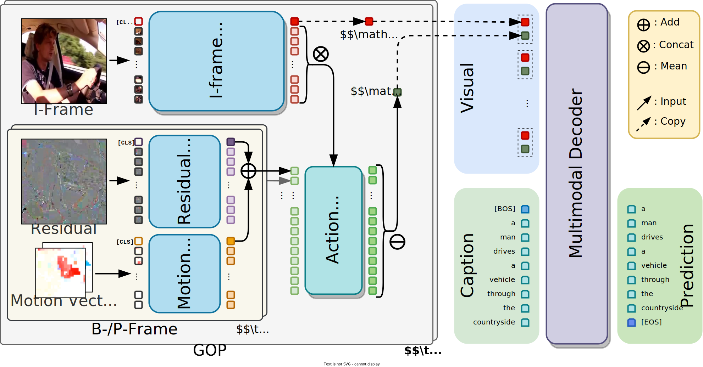
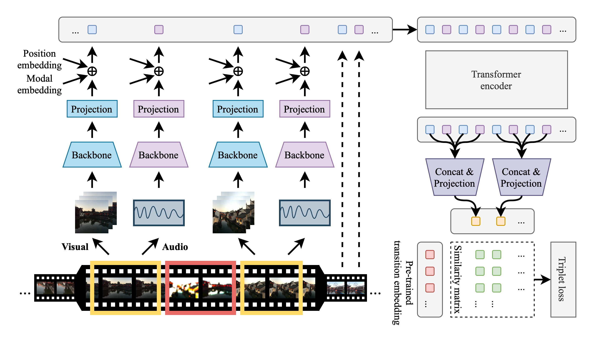

<table>
<tr>
<td width="50%">

</td>
<td>

Accurate and Fast Compressed Video Captioning  

*ICCV 2023*

**Yaojie Shen**, Xin Gu, Kai Xu, Heng Fan, Longyin Wen, Libo Zhang  

[Paper](https://arxiv.org/abs/2309.12867) | [Code](https://github.com/acherstyx/CoCap)

</td>
</tr>

<tr>
<td width="50%">

</td>
<td>

AutoTransition: Learning to Recommend Video Transition Effects  

*ECCV 2022*

**Yaojie Shen**, Libo Zhang, Kai Xu, Xiaojie Jin  

[Paper](https://arxiv.org/abs/2207.13479) | [Code](https://github.com/acherstyx/AutoTransition)

</td>
</tr>
</table>

Last Updated: September 2024

<!DOCTYPE html>
<meta charset="utf-8">
<title>Redirecting to https://yaojie-shen.github.io/publication/</title>
<meta http-equiv="refresh" content="0; URL=https://yaojie-shen.github.io/publication/">
<link rel="canonical" href="https://yaojie-shen.github.io/publication/">
