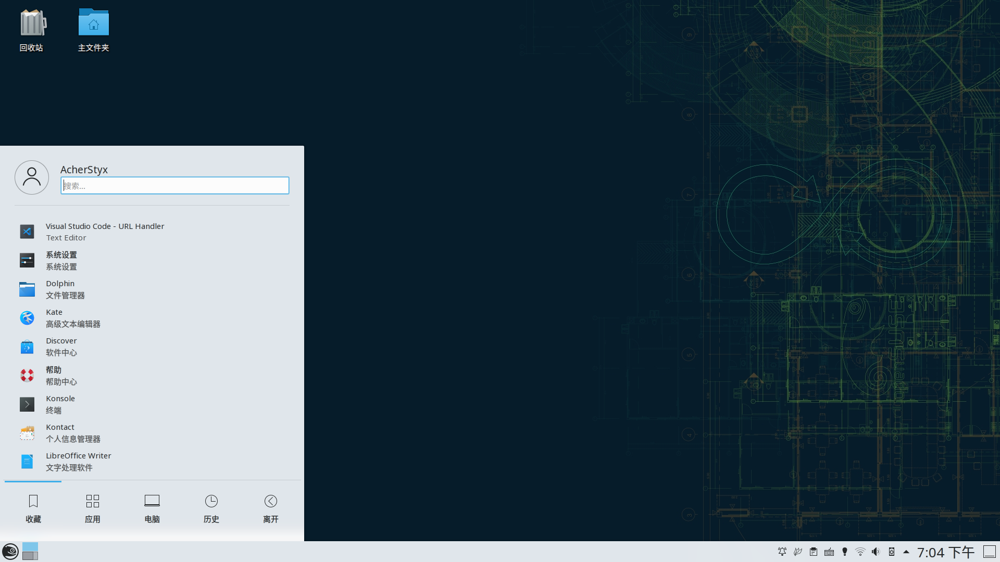
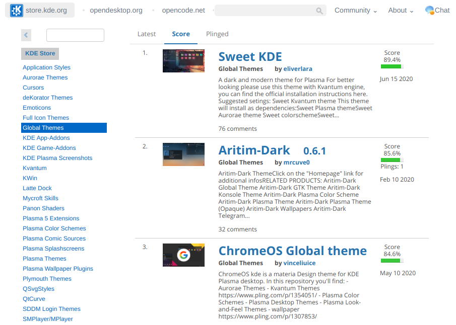
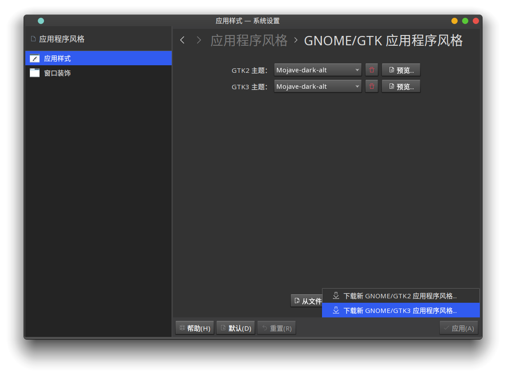
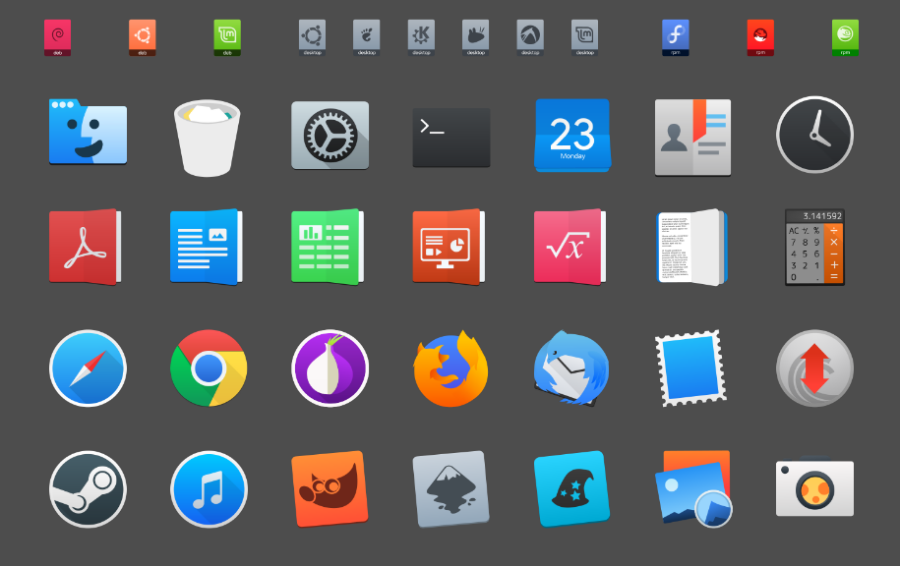
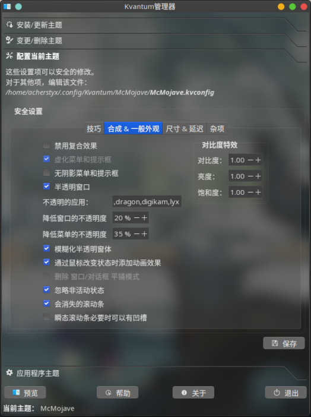
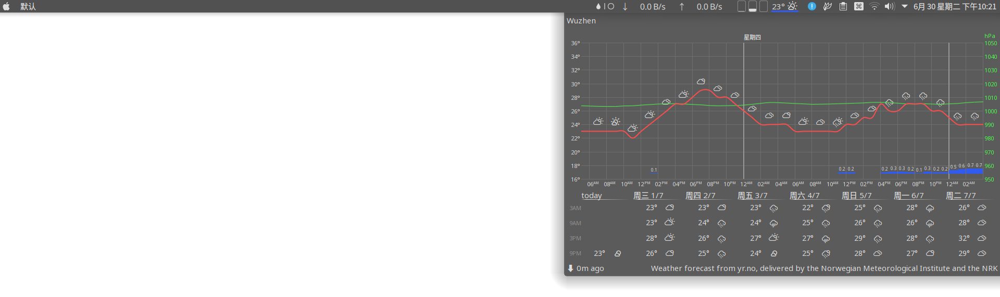

在经历了Linux环境的持续动荡之后，终于再一次配好了博客的环境。  
在系统变更的过程中更迭了多次不同的发行版本，也尝试了许多次的主题美化，最终桌面美化的结果也大致稳定下来。

同时，用了半个学期的Manjaro终究还是有硬件兼容问题，所以重新回归了openSUSE Tumbleweed，正好借重新配置的机会谈一谈KDE下的主题美化，记录下配置过程。  

<!--more-->

## Why KDE?

国内应为ubuntu的热度一直居高不下，所以很多时候接触的往往是Gnome桌面环境，当然在早一些可能是已经凉凉的Unity（比如我最初接触的就是Unity）。  
之所以选择KDE，主要还是应为以下几个原因：

**1. KDE拥有真正充分的可定制性**

你会发现在Gnome下，一个图标换起来都很麻烦。

**2. KDE Connect太香了**

你不知道KDE Connect? 不了解下？  
能衔接上一部分手机的生态，对于改善日常的Linux体验还是有不小的提升的，尤其是需要互发文件的时候。

## 初始桌面



相对来说，openSUSE的初始桌面其实也满不错的～

## KDE Store

首先推荐KDE Store：https://store.kde.org
类似的Gnome也有主题站点。

里面的内容和KDE下各类设置>获取主题中的内容是一致的，从中可以方便地寻找好的主题。




## Step 1. 主题配置

KDE设置中即提供了一系列的主题相关的配置，决定了总体的桌面风格，所以第一部即设置好这一系列的配置。以下的配置项如果找不到，只需要在设置>搜索栏搜索即可。

### 1. 全局主题

全局主题使用[vinceliuice](https://github.com/vinceliuice)的McMojave LAF，这位国人dalao真的作了相当多很赞的主题QwQ。  


比较好的主题普遍都会有黑白两种不同的版本，这个按照个人的喜好选择。个人选择了黑系的主题，应为经常半夜写代码所以白色会觉得刺眼 `(ノへ￣、)` ，效果如下。全局主题会替换掉下面的Plasma样式、应用样式、颜色、窗口装饰以及图标，算是一个总体的配置方案。


需要注意的是直接通过设置提供的下载会比较慢，推荐配置好代理再下载。  

### 2. Plasma样式

理论上讲，应用了全局主题之后，在设置>Plasma样式中应该已经转变为了McMojave主题。

### 3. 应用样式

之前的设置都是正对全局的，比如你的各类菜单，以及你的桌面面板都会受以上的配置影响，而应用样式主要决定应用内的显示效果。
应用样式选择Kvantum-dark，之后会对Kvantum主题进行配置。

### 4. GNOME/Gtk 应用程序主题

这一个主题主要是影响使用GTK的程序的，KDE是Qt党，所以之前的配置大多只针对Qt有效。  



### 5. 图标主题

比较特殊的是只要应用了McMojave这一个全局主题，图标就都空了，可能是它应用的图标主题没安装。

推荐的图标主题主要有以下几种，当然都可以在设置>图标中联网获取和设置。

**La Capitaine**



**McMojave-circle**

这一个主题的好处是缺失的图标会从numix-circle中继承，这样你只需要同时安装好numix-circle，就可以补全一部分缺失的图标。  


## Step 2. 设置Kvantum

首先安装Kvantum Manager。

```shell
sudo zypper in kvantum-manager kvantum-manager-lang
```

然后需要安装一个Kvantum主题，这边依旧选择McMojave主题，可以从[KDE Store下载](https://store.kde.org/p/1304957)。  

之后将下载下来的`tar.xz`压缩包解压，然后打开Kvantum Manager，选择这一个文件夹，安装主题。


接着将主题设置为McMojave，开始调整一些主题配置。在 合成&一般外观 里面选择忽略非活动状态，并降低窗口和菜单的透明度，即可获得很好的磨砂效果。



## Step 3. 桌面Dock和插件配置

```shell
zypper in latte-dock
```

目前（写作时）latte-dock的版本还只是0.9，为了获取悬空的效果所以实际安装了从Git源码编译的0.10版本，这一个版本应该不久就会正式发布。

接下来启动Latte Dock，并设置好它的开机启动（KDE中搜索”自动启动“应用），然后对Latte Dock的外观进行一些配置。

现在你可以在桌面上 右键>添加部件，来为Latte Dock添加一些小部件，同样的你可以点击下方的按钮联网获取新的小部件。


latte-dock只需要装一个额外的小部件：

- **Latte Seperator**：Latte Dock上分隔用的小横线

另外的部件都是用于顶栏的，从左到右使用到的小部件分别是：

- **Application title**：显示当前的应用名称，推荐改下设置，只显示应用名。
- **Window AppMenu Applet**：这一个插件**不能在设置里安装**！需要编译安装，幸运的是openSUSE的软件源中自带了，通过`sudo zypper in applet-window-appmenu`安装即可。
- **颜色拾取器**：自带的。
- **Netspeed Widget**：网速显示。
- **系统符合查看器**：自带的，不过为了适合主题要改下其设置，调整下颜色方案。
- **Weather Widge**：一个UI不错的天气插件，特别是带了磨砂后看起来很赞。需要设置以下地理位置，并且勾上 `Appearance>Render meteogram for yr.no`，否则雨量的图形会是一片白的背景。
- **系统托盘**：自带。
- **Event Calendar**：可以同步Google日历。需要设置下时间的格式等，也同时带有类似的天气界面。

按照以上的配置后的顶栏效果如下：



接下来对Latte Dock进行配置，把想要的应用拖进取，左边添加一个自带的全屏形式的应用程序面板，右边则添加一个虚拟桌面调度器。


## 小结

以上主要设置了一下整体的主题和Kvantum主题，并添加了一些桌面插件，整理了桌面的外观。
目前一个大致的主题已经有了，其他还有一些细节的配置，主要还有以下这些：

- Dolphin的外观
- Yakuake的主题配置
- 字体调整
- Fcitx主题调整
- 终端主题的配置
- KDE动画效果的调整
- 触摸板手势
- 应用、桌面、活动切换的配置
- 屏幕边缘动作
- ......（还差亿点）

这些就之后再说～
想到这里突然又想继续用之前的Manjaro了`(￣ε(#￣)☆╰╮o(￣皿￣///)`。

真的全部配置完还是不容易，所以要好好珍惜系统，远离ubuntu，选用支持Btrfs的系统，特别是openSUSE这样带有业界最好的原生Btrfs快照备份设置的系统，设置好Btrfs备份，并按时做额外的分区备份。`（づ￣3￣）づ`
