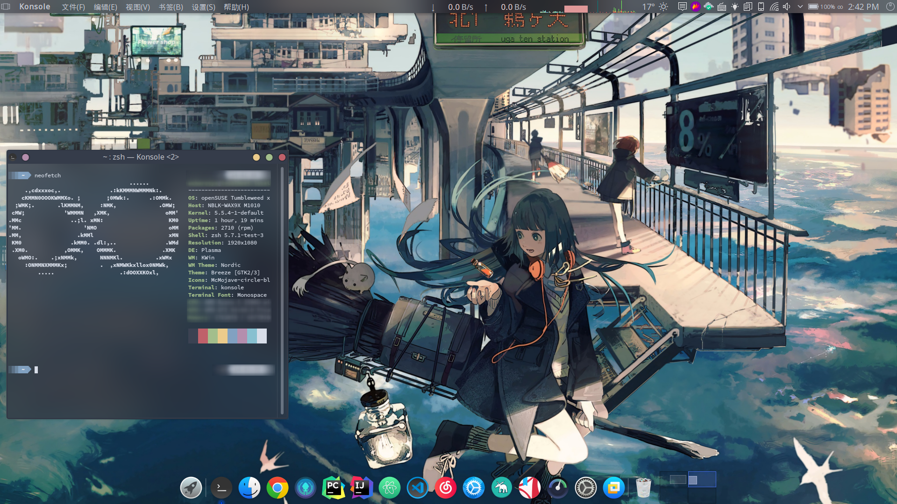
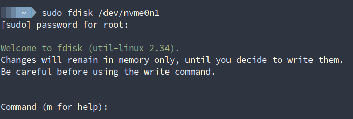
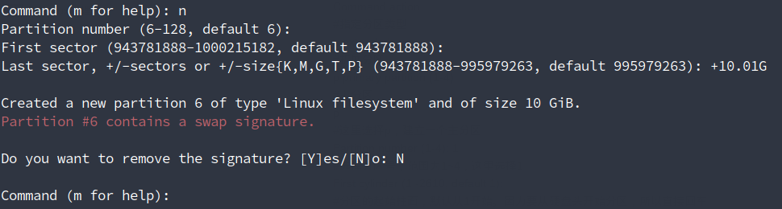

这篇文章的起因是在Windows下的一次分区操作，结果导致了一段悲伤的故事T^T。
不过这一次的系统崩溃还是有不少收获的：

1. 捡回了我的操作系统。
2. 和Linux双系统时，绝对不要在Windows下进行分区操作。
3. 关于Linux分区丢失之后的找回方法（重要）。
4. 启动问题解决途径。

需要注意的是，这篇文章并非是对这一问题的专业解读，只是一个问题解决的思路的整理（**思路>问题解决>放置问题**）。

最终的建议可能是，不要在有双系统的时候，在Windows下进行分区操作，ubuntu的Live CD是个不错的选择，里面一直自带gparted。

<!--more-->

放张目前的桌面 :-D
估计可以写一篇美化指南了？？Linux的美化是费时费力的，但收获是成正比的。

\

## Windows分区会导致的问题

首先，导致问题的根源在于使用Windows下的软件进行了分区（具体是使用了傲梅分区助手），正常情况在Windows环境下使用这个软件是不会有任何问题的，但是关于Linux系统这一面就不是同一回事了。

由于这一（但不仅限于）分区软件并不识别所有的分区类型，对于Linux下典型的Ext分区是直接不显示的。

> 直接显示了未分配，视为了空白空间

要导致Linux下分区消失，根据以往经历，笔者猜测出需要满足这两个条件：

1. 首先就是**分区不显示**，不能识别这一分区。

> 理由是隔壁的DiskGenius在我装完Linux后装Windows时也进行了分区操作，但是并没有出现问题，此时DiskGenius是识别了的，只是显示未知分类。

2. **对于分区表进行了改动**，出现了分区的创建、格式化成另一种格式，不包含移动分区。

> 我这一次问题出现的原因就是把一个Fat32格式的分区格式化成了exFat，但同种格式的格式化预估不会有问题。至于移动分区，在之前也用傲梅分区助手移动过两个ESP分区，但是均没有出现问题。

### 分区编号的重置

在使用Windows下的分区软件进行分区编辑之后，在Linux这一边都会遇到同样的一个问题：分区编号变了！  

想必有些许了解就会知道，在linux下分区是标成sda1，sda2，……这样的格式的，但是Windows下倒没有遇到这一概念。问题在于Windows下分区后，这些编号会重置，序号会对因它是磁盘内从头开始的第几个分区，可能直接导致Linux下依赖于此的挂载出现问题。所以尽量使用UUID进行区分吧。  

### 问题的根源（猜测）

基于个人已有的信息，导致分区消失的根本原因因该是Windows下的分区操作导致了分区表被重写了，而那些未被识别的分区，由于软件根本不识别他们，因而直接在重建的时候跳过了这些分区。这也能解释为什么移动没有问题：修改起止的扇区号即可。  
总之这样导致的分区丢失可以概括成：**分区没事，分区表炸了**。这一点还是十分肯定的。  

---

## 分区找回

既然问题的原因在于分区表被改写后，着一分区没有被纳入到分区表，那么可以送一口气的是：数据没事。毕竟数据没有被覆盖写入，就不会有问题。那问题就在于怎么把分区给补回分区表了，这一操作简单便捷，但是倒没找到什么资料，百度也保持着它的传统……

### 问题确认

分区丢失的症状很明显：重启后引导不了，直接进入了Grub，Windows继续活得蛮滋润。
在Grub命令行下使用基本的命令可以查看到分区，以此确认分区是否丢失。

### 分区修复

#### Step 1. 准备一Ubuntu镜像

要修复分区，首先需要准备一个ubuntu镜像。制作过程很简单，基于UEFI的便捷与强大，只需要创建一个Fat32格式的分区然后把镜像内文件全复制进去，在BIOS的启动菜单里就因该能看到这一启动项了，这一步可以参照网上的装Ubuntu的教程。启动后**选择试用（Try xxx!)**，进入下一步。  

#### Step 2. 使用fdisk创建分区

工具使用fdisk，在Ubuntu下是自带的。其实并不限于Ubuntu，能用fdisk即可完成下面的修复。  
下面截图来自于模拟，在这一次的分区丢失中，我的Swap分区也被删除了，就用它的恢复来做一个例子。  

```shell
sudo fdisk /dev/nvme0n1
```



之后使用fdisk在原本分区所在的位置重新创建一个分区即可：


