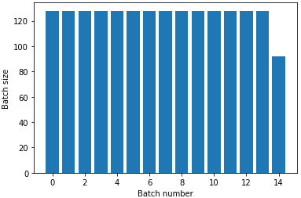
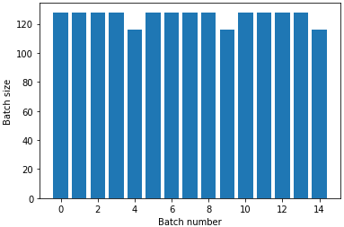
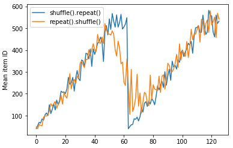

`tf.data`用于构建Tensorflow的数据加载。  

在`tf.data`中引入了`tf.data.Dataset`这样一个抽象来表示一系列的element，每一个元素都由一定的component组成。（如一个图像训练的样本可以看作一个element，其中包含了图像和标签两个component）  

```mermaid
graph LR;
    D(Dataset)-->E1(Element)
    D-->N1(...)
    E1-->C1(Component)
    E1-->N2(...)
    classDef wbox fill:#fff,stroke:#fff;
    class D,E1,N1,N2,C1 wbox;
```

## 获取数据输入

### 由NumPy数组创建

对于在内存中的数据，使用`Dataset.from_tensor_slice`是最方便的：

```python
train, test = tf.keras.datasets.fashion_mnist.load_data()
dataset = tf.data.Dataset.from_tensor_slices((images, labels))
```

> &star; 上面的创建方式仅适用于小数据集，因为浪费内存。  

### 由Python generator创建

`Dataset.from_generator`将一个Python generator转换为`tf.data.Dataset`，它以一个callable作为输入（而非一个iterator）。  

```python
ds_counter = tf.data.Dataset.from_generator(count,  # python generator
                                            output_types=tf.int32,
                                            args=[25],  # args for generator
                                            output_shapes = (),
                                            )
```

在参数列表中：
`args`用来提供Python generator初始化所需要的参数。  
`output_type`必须要指定以确定数据类型。  
`output_shape`是可选的，但是因为Tensorflow中的部分操作不支持未知的shape因而最好指定。如果shape是可变的或未知，可以定义为`None`，对于scalar其形状为`()`。  

> &star; 使用比较方便，但是需要注意可能会有兼容性、可移植性方面的问题。  

### 由TFRecord创建

使用`tf.data.TFRecordDataset`来实现从一个或多个TFRecord文件导入数据，只需要提供`filenames`参数即可，接受单一字符串、字符串列表或者字符型的`tf.Tensor`。  

```python
dataset = tf.data.TFRecordDataset(filenames = [fsns_test_file])
```

这样读出来的只是**二进制数据**，通常使用`tf.train.Example`来序列化存储，对于这样的数据需要进行解码：  

```python
raw_example = next(iter(dataset))
parsed = tf.train.Example.FromString(raw_example.numpy())

parsed.features.feature['image/text']
```

### 由text数据创建

使用`tf.data.TextLineDataset`，只需要提供`.txt`格式的文件路径即可：  

```python
dataset = tf.data.TextLineDataset(file_paths)
```

默认的`TextLineDataset`是逐个文件地给出其中的每一行，使用`Dataset.interleave`可以在各个文件之间依次切换着输出每一行。  

```python
files_ds = tf.data.Dataset.from_tensor_slices(file_paths)
lines_ds = files_ds.interleave(tf.data.TextLineDataset, cycle_length=3)
```

### 由CSV数据创建

对于CSV格式的数据，在加载到内存之后当然也可以使用`Dataset.from_tensor_slice`来创建`Dataset`，不过我们更希望能直接从硬盘中读取。  
`experimental.make_csv_dataset`可以直接读取CSV格式的文件：

```python
titanic_batches = tf.data.experimental.make_csv_dataset(
    titanic_file, batch_size=4,
    label_name="survived")  # survived这一列被额外划分为标签列

for feature_batch, label_batch in titanic_batches.take(1):  # 返回时，数据和标签会分开返回
  print("'survived': {}".format(label_batch))
  ...
```

另外，`select_columns`参数可以只把其中需要的几列挑选出来：

```python
titanic_batches = tf.data.experimental.make_csv_dataset(..., select_columns=['class', 'fare', 'survived'])
```

:pill:**直接通过这一个函数创建的数据集，label部分是按照标签分开的，需要使用一下方式进行合并！**

```python
def pack_features_vector(features, labels):
  """将特征打包到一个数组中"""
  features = tf.stack(list(features.values()), axis=1)
  return features, labels
```

除了这一个函数，还有一个更低级的[`experimental.CsvDataset`](https://www.tensorflow.org/api_docs/python/tf/data/experimental/CsvDataset)，它不支持每一列的自动类型推导，但这也意味着可以手动控制每一列的数据类型，并且第二个参数还可以同时为空缺的数据指定默认值。

```python
# 依次指定每一列的类型
titanic_types  = [tf.int32, tf.string, tf.float32, tf.int32, tf.int32, tf.float32, tf.string, tf.string, tf.string, tf.string]
dataset = tf.data.experimental.CsvDataset(titanic_file, titanic_types , header=True)
```

> &star; 从函数名可以看出这一系列都是实验性函数，之后版本的API中可能出现更改。  


### 由一系列文件创建

有时候数据集会以分散在目录里的一系列文件的形式给出，对于这样的数据可以以文件路径作为信息构建数据集，使用`Dataset.list_files()`函数来构建：  

```python
list_ds = tf.data.Dataset.list_files(str(flowers_root/'*/*'))
```

其中每一个element的形式是文件路径：

```python
b'/home/kbuilder/.keras/datasets/flower_photos/roses/15566697073_9a214b700e_n.jpg'
```

---

## 数据处理

### Dataset.map

对于数据处理，一个很重要的变换函数是`Dataset.map`，它可以将一个指定的函数`f`应用到数据集中的每一个element上，以实现数据的批量处理。  

在指定的函数`f`中，可以使用Tensorflow的API，也支持使用其他的Python API来处理数据。  
对于一些使用`tf.Train.Example`原型来存储的数据，就理所当然的可以应用`Dataset.map`来对原始数据进行解码。

#### 通过Dataset.map实现图像解码

很显然图像的解码可以通过和`Dataset.map`的配合来实现。  

```python
# 1. 载入原始数据集
list_ds = tf.data.Dataset.list_files(str(flowers_root/'*/*'))

# 2. 定义实现图片的解码的函数
def parse_image(filename):
  parts = tf.strings.split(filename, '/')
  label = parts[-2]

  image = tf.io.read_file(filename) # 读入图片（文本形式）
  image = tf.image.decode_jpeg(image) # 解码成正式的图片数据
  image = tf.image.convert_image_dtype(image, tf.float32)
  image = tf.image.resize(image, [128, 128])  # 也提供了resize操作
  return image, label

# 3. 通过map方法来应用到每一个element上
images_ds = list_ds.map(parse_image)
```

### 样本过滤

使用[`Dataset.skip()`](https://www.tensorflow.org/api_docs/python/tf/data/Dataset#skip)变换可以跳过开头的几个样本，[`Dataset.filter()`](https://www.tensorflow.org/api_docs/python/tf/data/Dataset#filter)可以使用特定的条件对于数据集中的element进行筛选，只需要提供一个判断用的函数。  

```python
def survived(line):     # 函数定义判断条件，符合条件的时候返回true，保留对应元素
  return tf.not_equal(tf.strings.substr(line, 0, 1), "0")

survivors = titanic_lines.skip(1).filter(survived)
```

### 时序数据

对于和时序相关的数据，原始数据是“时间”上连续的，为了构建数据集，我们往往需要以此创建连续的时间切片。

```python
range_ds = tf.data.Dataset.range(100000)  # 以range为例
```

#### 通过batch

基本思路为：

1. 先转化为一系列batch，这样每一个element就是一个batch的数据。  
2. 应用`Dataset.map`来处理每一个batch，分割出输入和输出。  

```python
# step 1 变为batch
batches = range_ds.batch(10, drop_remainder=True)

# step 2 通过map来分割，创建出训练数据和标签
def dense_1_step(batch):
  # Shift features and labels one step relative to each other.
  return batch[:-1], batch[1:]

predict_dense_1_step = batches.map(dense_1_step)
```

#### 通过window

使用`Dataset.window`可以更好地控制这一个过程，但注意这一函数返回的Dataset中element依旧是Dataset。可以利用`Dataset.flat_map`方法，它要求作为参数的`map_func`是一个将element转化为Dataset的函数，然后它会将返回的Dataset展开。  

```python
def make_window_dataset(ds, window_size=5, shift=1, stride=1):
  windows = ds.window(window_size, shift=shift, stride=stride)
  # shift代表窗口每次滑动的量，而stride代表元素之间的间隔

  def sub_to_batch(sub):  # 转化为batch，这样之后的处理手法就和上面通过batch的方法一致了
    return sub.batch(window_size, drop_remainder=True)
  
  windows = windows.flat_map(sub_to_batch)
  return windows

ds = make_window_dataset(range_ds, window_size=10, shift = 5, stride=3)

for example in ds.take(10):
  print(example.numpy())
  # [ 0  3  6  9 12 15 18 21 24 27]
  # [ 5  8 11 14 17 20 23 26 29 32]
  # ...
  # [45 48 51 54 57 60 63 66 69 72]
```

这样就相当于在整一条的数据上使用“滑动窗口”一样的方法，以特定的shift值过了一遍。之后再利用上面的在batch中创建出训练集和标签的方法，即可完成数据集的创建。  

---

## 数据输出

### 分批量输出

#### 定长数据：batch

使用`Dataset.batch()`可以方便地产生批量数据，约束条件是其中每一个元素都要拥有相同的形状。  
对于输出的批量，在默认的函数设置下是未知的，因为最后一个batch可能是不全的，Tensorflow无法判断所以将其形状设为None。可以使用`drop_remainder`参数来丢弃最后一个不完全的batch，这样其形状就会固定了。  

```python
batched_dataset = dataset.batch(7, drop_remainder=True)
# <BatchDataset shapes: ((7,), (7,)), types: (tf.int64, tf.int64)>
# 如果drop_remainder设为False则为
# <BatchDataset shapes: ((None,), (None,)), types: (tf.int64, tf.int64)>
# 形状不能确定
```

#### 不定长数据：padded_batch

对于不定长的数据，在分批量调用的时候注意使用`Dataset.padded_batch`而非一般性的`Dataset.batch`  

```python
ds_series_batch = ds_series.shuffle(20).padded_batch(10,((),(None,))

ids, sequence_batch = next(iter(ds_series_batch))
print(ids.numpy())
print()
print(sequence_batch.numpy())
```

> &star; padded_batch需要指定形状，在Tensorflow Guide的文章中写错了，没有指定形状。同时形状的描述也很特别，值得考量。  
> 填充的值可以指定。  
> 详见API：[`Dataset.padded_batch`](https://www.tensorflow.org/api_docs/python/tf/data/Dataset#padded_batch)。  

输出形式如下：  

```python
[ 2 16 20 10  6 14 19  9 24 27]

[[ 0.4466  0.6624  1.4652  0.      0.      0.      0.      0.      0.    ]
 [ 0.2223 -0.6065  0.5422  0.4195  0.5124 -0.5322  0.0428  0.3617  1.5245]
 ...
 [-0.3334 -1.0381  1.1201 -0.4033 -0.6819  0.      0.      0.      0.    ]]
```

### 多epoch重复输出

使用`Dataset.repeat()`变换可以实现重复枚举数据：  

```python
titanic_batches = titanic_lines.repeat(3).batch(128)
```

> 无参数的`Dataset.repeat()`会无限地重复枚举。  
> 注意`repeat`和`batch`的调用顺序会影响输出数据的长度变化（主要因为最后一个batch会不全）:  

|先repeat|先batch|  
|:---:|:---:|  
| |  |

### 随机化

`Dataset.shuffle()`通过维护指定大小的buffer并**从中**随机选取来实现一定程度的随机输出。  

```python
dataset = dataset.shuffle(buffer_size=100)
```

> &star; 对于这样的随机方案，随机的完全性取决于buffer的大小，大的buffer虽然随机性更好但是占用**大量内存**。  
> 对于随机，先调用`repeat`或是`shuffle`也会存在差异：
> 

---

## 参考

1. [tf.data: Build TensorFlow input pipelines | TensorFlow Core](https://www.tensorflow.org/guide/data#consuming_csv_data)  
2. [tf.data.Dataset | TensorFlow Core](https://www.tensorflow.org/api_docs/python/tf/data/Dataset)  
