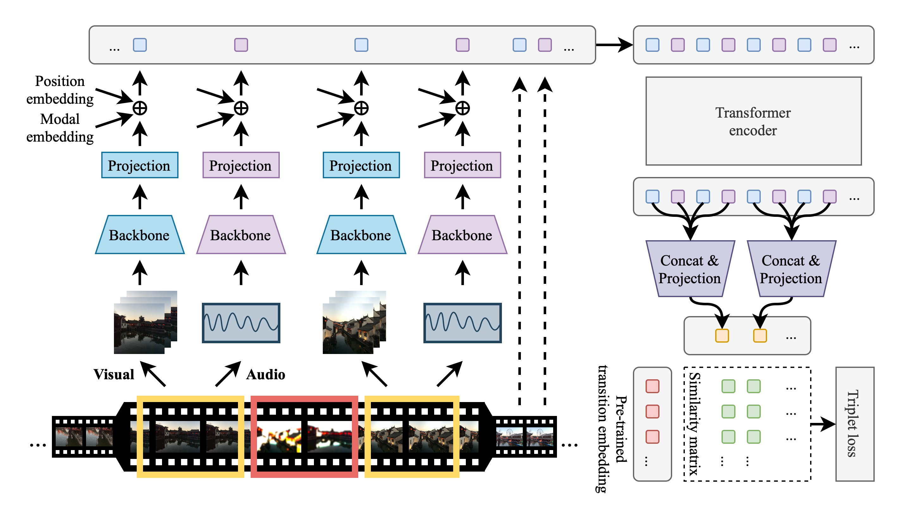

Hi! 👋

I'm currently a first-year Master's student at Institute of Software, Chinese Academy of Sciences. Before that, I achieved the Bachelor's degree from University of Electronic Science and Technology of China (UESTC).

My primary research interest lie in the fields of Computer Vision and Multimodality.

[GitHub](https://github.com/AcherStyx) | [Google Scholar](https://scholar.google.com/citations?user=RPtepygAAAAJ) | [LinkedIn](https://www.linkedin.com/in/yaojie-shen-b03248200/) | [Email](mailto:SYJ.Micro@outlook.com)

## Publication

<table>
<tr>
<td width="40%">

</td>
<td>

AutoTransition: Learning to Recommend Video Transition Effects

**Yaojie Shen**, Libo Zhang, Kai Xu, Xiaojie Jin

*ECCV 2022*

[Paper](https://arxiv.org/abs/2207.13479) / [Code](https://github.com/AcherStyx/AutoTransition)

</td>
</tr>
</table>

